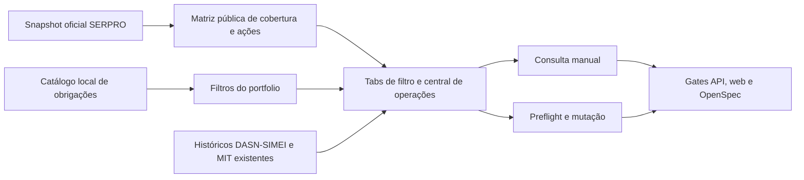

## Context

A central já usa `MonitoringModuleTable`, o portfolio genérico e projeções locais de `tax_obligation_*`. O catálogo dessas projeções contém PGDAS-D, DEFIS, DASN-SIMEI, DCTFWeb e MIT, mas a navegação anterior só filtrava parte desse universo. O recorte declarativo do snapshot oficial contém 33 operações: PGDAS-D (9), DEFIS (4), DASN-SIMEI (3), DCTFWeb (13) e MIT (4). A verificação da navegação e dos contratos oficiais em 2026-07-21 confirmou 23 operações `PRODUCTION`; as 3 DASN-SIMEI e 7 DCTFWeb restantes estão `PROSPECTION`. As páginas DASN-SIMEI declaram explicitamente que as funcionalidades ainda não estão disponíveis para contratação, e as 7 operações DCTFWeb em prospecção não compõem a lista atual de serviços ativos.

O endpoint autenticado `GET /api/v1/fiscal/declarations/catalog` já é a fronteira pública adequada para definições e calendário. Os históricos de DASN-SIMEI e MIT também já existem em endpoints tenant-scoped e componentes reutilizáveis. A change é transversal entre API e web, mas permanece em uma única capability porque entrega um único resultado implantável: a central de declarações completa e honesta.

## Goals / Non-Goals

**Goals:**

- Projetar uma matriz pública, sanitizada e determinística a partir do snapshot oficial versionado.
- Tornar end-to-end endereçáveis todas as 23 operações oficiais em produção: 13 de leitura/apoio e 10 mutantes.
- Expor status operacional, validação, preflight, confirmação, idempotência, acompanhamento e reconciliação sem receber coordenadas técnicas do cliente.
- Cobrir as cinco obrigações declarativas RFB relevantes e separar FGTS/DIRF como cobertura externa.
- Garantir que overview, lista e detalhe compartilhem o mesmo filtro por obrigação.
- Reutilizar históricos locais, sem chamada oficial implícita ao abrir uma ação, e oferecer uma central guiada de operações explícitas.
- Preservar o shell, a URL canônica e o padrão de tabela do dashboard.

**Non-Goals:**

- Promover operações `PROSPECTION` para `PRODUCTION` ou permitir egress real para elas.
- Consultar o SERPRO ao carregar a página ou o catálogo.
- Ativar flags/cohorts de mutação, credenciais, procurações, Termo de Autorização, kill switch ou egress por padrão.
- Criar tabelas, jobs, serviços Compose, parecer de aplicabilidade fiscal ou integração FGTS/DIRF nova.
- Criar um editor fiscal completo que substitua validações de negócio da RFB; payloads complexos podem ser importados como JSON e são validados estruturalmente pelo backend.

## Decisions

### 1. Matriz derivada do snapshot, não duplicada em constantes da UI

Um `DeclarationIntegrationCoverageService` lerá `resources/serpro/official-service-catalog.v2026-07-16.json`, selecionará os sistemas `PGDASD`, `DEFIS`, `DASNSIMEI`, `DCTFWEB` e `MIT` e produzirá, por código de obrigação, contadores por estado oficial, rotas documentadas e estados de consulta/transmissão. A resposta pública omitirá coordenadas e `operation_key`.

Alternativa considerada: manter badges estáticos no Vue. Rejeitada porque divergiria do snapshot e não teria teste de contrato único.

FGTS e DIRF serão entradas explícitas da matriz como fontes externas, respectivamente `PARTIAL` e `UNSUPPORTED`; elas não serão falsamente associadas a operações do Integra Contador.

### 2. Catálogo público de operações com allowlist server-side

`GET /fiscal/declarations/catalog` incluirá `operations`, derivado do snapshot e enriquecido por um registro curado de ações. Cada item terá `action_id` público estável, obrigação, rótulo, rota, mutabilidade, estado oficial, disponibilidade, parâmetros públicos, efeito e estratégia de resultado. Não haverá `operation_key`, coordenadas, schema bruto ou payload de exemplo na resposta.

O servidor resolverá `action_id` para `operation_key` e coordenadas. A API rejeitará ações ausentes da allowlist, `office_id`, parâmetros técnicos, operações de prospecção e payload incompatível. Isso preserva o executor central e impede uma fachada genérica arbitrária sobre o Integra Contador.

### 3. Reusar `GET /fiscal/declarations/catalog`

O controller continuará tenant-authenticated por Sanctum/`CurrentOffice` e passará a retornar objeto com `obligations`, `calendar` e `integration_coverage`. Não haverá `office_id` recebido do cliente nem conteúdo específico de outro escritório. O catálogo em si é global e somente leitura.

Alternativa considerada: criar `/declarations/coverage`. Rejeitada para evitar uma segunda carga e fragmentação de um contrato que já representa o catálogo da central.

### 4. Sete abas em dois grupos sem alterar a URL

O estado local aceitará `PGDAS`, `DEFIS`, `DASN_SIMEI`, `DCTFWEB`, `MIT`, `FGTS` e `DIRF`, com PGDAS como default. O seletor será horizontal e rolável via `ShellScrollableTabs`, com o mesmo tamanho, variante e comportamento das tabs de filtro das demais carteiras. FGTS/DIRF terão estados localizados apenas quando ativos; não haverá cards descritivos permanentes. A URL permanece `/monitoring/declarations`.

Alternativa considerada: criar rotas aninhadas. Rejeitada por violar o contrato de URL canônica e duplicar middleware.

### 5. Filtro por código canônico da obrigação

`ModulePortfolioQueryService::declarationsObligationCode()` mapeará DASN-SIMEI para `DASN_SIMEI` e MIT para `MIT`. Os filtros SQL de elegibilidade, contadores e detalhes continuarão usando `tax_obligation_definitions.code`, de modo que lista e overview compartilhem a população. Ausência de projeções retorna vazio honesto.

### 6. Dois pipelines de execução, ambos explícitos

As 13 ações `Consultar`/`Apoiar` em produção usarão a policy e os adapters da consulta manual já revalidados no request e no worker. Os gaps de metadados/handlers serão preenchidos, sem criar chamada remota no carregamento da página.

As 10 ações `Emitir`/`Declarar` em produção usarão `FiscalMutationService`: preflight, senha recente, papel ADMIN, procuração, plano, orçamento, flags/cohort, confirmação textual, idempotência, persistência de estado, resultado incerto e reconciliação por operação consultiva correspondente. O request factory passará dados de negócio validados ao executor; `MutationAuthorization` somente será emitida a partir de uma operação persistida e revalidada. Defaults continuam OFF, portanto uma implantação não configurada mostra `BLOCKED` sem egress.

### 7. Codecs e contratos de payload

Cada ação produtiva terá um codec/validador server-side com nomes de negócio. Operações simples usam campos tipados; PGDAS-D/DEFIS/MIT complexas aceitam objeto JSON importado, aplicam limites de profundidade/tamanho, proíbem chaves técnicas e validam campos estruturais obrigatórios do contrato oficial. Identidades e `cnpjCompleto` são resolvidos/confirmados pelo servidor, nunca adotados de uma coordenada fornecida pelo frontend.

Respostas são normalizadas para os estados `QUEUED`, `PROCESSING`, `SUCCEEDED`, `FAILED`, `BLOCKED` e `UNCERTAIN`, preservando os estados detalhados locais. HTTP 202/204 e reconciliações não são convertidos em sucesso prematuro.

### 8. Históricos existentes e abertura sem efeito colateral

DASN-SIMEI abrirá `MeiPublicServicesModal` já selecionado em `dasn`; MIT abrirá `MitListaApuracoesModal`. Ambos carregam somente estado local ao abrir. Consultas oficiais continuam dependendo da ação explícita existente e dos gates atuais. Os demais modais permanecem inalterados.

### 9. UX compacta e sem promessas falsas

As tabs terão paridade visual com os filtros do painel e uma única ação compacta `Operações` abrirá a central da obrigação ativa. O catálogo, os filtros por rota/estado, o formulário guiado e o acompanhamento ficam dentro do modal; a página não exibirá cards descritivos de cobertura/operações. `PROSPECTION`, `PARTIAL` e `UNSUPPORTED` terão copy específica somente no contexto em que importam. A tabela continuará sendo o foco principal para caber no viewport de referência.

## Mapa de dependências

- Ownership API: serviços de cobertura/ações, `DeclarationHubController`, codecs/adapters, mutation flow, `FiscalModuleKey` e trecho de declarações do `ModulePortfolioQueryService`.
- Ownership web: `fiscal-modules.ts`, cliente do catálogo, `declarations.vue`, componentes/composable da central de operações e testes.
- Changes ativas de parcelamentos/caixa postal não são upstream e podem rodar em paralelo. Não serão editados artefatos dessas changes.
- Rollout: API e web juntos; a adição de campos ao catálogo é backward-compatible.
- Rollback: reverter UI e campos adicionais; os submódulos extras aceitos na API são compatíveis com callers antigos.

## Risks / Trade-offs

- [Snapshot fica desatualizado] → Exibir `verified_at`, testar o manifest e manter a versão como fonte única; nenhuma afirmação de validação produtiva.
- [Operação em prospecção parecer executável] → Calcular separadamente estado oficial, implementação e disponibilidade; `PROSPECTION` nunca vira ação executável.
- [Vazamento entre offices] → Reusar `CurrentOffice` e endpoints tenant-scoped; matriz global não contém dados fiscais nem identificadores de tenant.
- [Segredos ou coordenadas na API] → Whitelist de campos públicos e teste negativo para `operation_key`, `id_sistema`, `id_servico`, payloads e schemas.
- [Bilhetagem SERPRO acidental] → Catálogo lê arquivo local; abertura dos modais só consulta persistência local; consulta remota exige ação explícita já protegida.
- [Kill switches contornados] → Fachada resolve somente `action_id` allowlisted; mutações continuam no policy central e flags OFF.
- [Payload fiscal complexo inválido] → Codec por ação, limites de tamanho/profundidade, proibição de coordenadas/identidades técnicas, preflight e erro 422 antes de qualquer egress.
- [Timeout causar duplicidade] → Idempotência persistida, `UNCERTAIN` bloqueia retry e reconciliação nunca repete a mutação.
- [Sete abas apertadas em 1366 px] → Controle rolável e responsivo, sem aumentar o shell ou criar segunda navegação global.
- [Conflito no worktree já modificado] → Edições cirúrgicas nos arquivos da capability e preservação integral das mudanças alheias.

## Migration Plan

1. Entregar serviço e contrato de catálogo com testes de sanitização.
2. Liberar filtros DASN-SIMEI/MIT no portfolio com testes de população.
3. Entregar tipos, tabs de filtro, ação compacta e modais no Nuxt.
4. Completar registro/codec/executor das 13 leituras e 10 mutações produtivas.
5. Integrar central de operações, formulários guiados e acompanhamento no Nuxt.
6. Rodar gates focados, depois gates completos das áreas e validação OpenSpec.
7. Não há ativação de flags/credenciais; rollback da central é de código e mantém operações persistidas auditáveis.

## Open Questions

- Nenhuma bloqueante. A promoção futura de DASN-SIMEI ou das sete DCTFWeb em prospecção dependerá de mudança oficial para `PRODUCTION` e go-live separado; esta change apenas mantém seus contratos/status visíveis e bloqueados.
