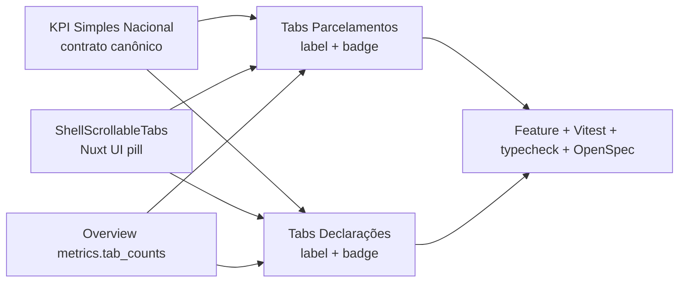

## Context

`MonitoringKpiStrip`, usado nas carteiras de Simples Nacional e demais módulos, é a referência visual das tabs de filtro: `ShellScrollableTabs`, tamanho `md`, aparência nativa `pill`/`primary`, classe `w-full min-w-0 max-w-full` e uma `badge` numérica por item. Parcelamentos e Declarações já usam o mesmo componente e agora compartilham sua estrutura, mas seus itens ainda não fornecem o contador que ocupa o slot `trailingBadge` do Nuxt UI.

A inspeção do tema gerado do Nuxt UI 4 (`.nuxt/ui/tabs.ts`) confirma que `pill` aplica lista `bg-elevated rounded-lg`, indicador `bg-primary` e tamanhos de trigger definidos pelo variant `size`. Portanto, a correção deve preservar o tema nativo e atuar apenas na estrutura de contenção.

## Goals / Non-Goals

**Goals:**

- Fazer as tabs locais de Parcelamentos e Declarações terem a mesma altura, padding, cor, raio e comportamento responsivo da cápsula KPI de Simples Nacional.
- Exibir uma badge com contagem real em cada modalidade e obrigação, mantendo os valores estáveis quando o operador alterna a tab.
- Manter o scroll touch dentro da faixa e impedir que ações irmãs alterem o cálculo interno das tabs.
- Tornar a paridade verificável por testes de contrato visual do markup.

**Non-Goals:**

- Alterar itens, seleção, semântica dos filtros, URLs, catálogo de modalidades ou obrigações.
- Mover ou remover a ação `Operações` de Declarações.
- Criar um novo tema de tabs, sobrescrever slots visuais do Nuxt UI ou redesenhar o shell.
- Alterar tenancy, persistência, jobs, SERPRO, flags, canais externos ou Compose.

## Decisions

### 1. O KPI de Simples Nacional permanece a referência canônica

As duas páginas usarão o mesmo conjunto explícito da referência: `ShellScrollableTabs`, `size="md"` e classe `w-full min-w-0 max-w-full`. `color="primary"` e `variant="pill"` serão removidos das instâncias porque já são defaults do wrapper; isso evita drift sem introduzir um segundo componente de abstração.

Alternativa considerada: criar `MonitoringCapsuleTabs`. Rejeitada porque apenas encapsularia defaults já centralizados em `ShellScrollableTabs` e aumentaria uma camada sem comportamento novo.

### 2. Ações ficam fora do wrapper rolável das tabs

Em Declarações, um filho `min-w-0 flex-1` conterá somente a faixa canônica, enquanto `Operações` continuará como irmão `shrink-0`. No mobile a composição permanece empilhada; em `sm+` a faixa ocupa o espaço restante sem compartilhar seu overflow com o botão.

Em Parcelamentos, o wrapper adotará a mesma anatomia do `MonitoringKpiStrip`, sem ação irmã.

Alternativa considerada: mover `Operações` para navbar ou toolbar. Rejeitada porque mudaria a hierarquia já contratada pela change declarativa.

### 3. Contagens dimensionais usam o overview existente

O read model publicará `metrics.tab_counts` somente para Parcelamentos e Declarações. Cada valor representa clientes distintos no mesmo escopo tenant e com os mesmos filtros globais da carteira, removendo apenas a dimensão controlada pela própria faixa (`modality` ou `submodule`). Assim, clicar em uma tab não faz as badges das demais mudarem.

Parcelamentos inclui `all` e as oito modalidades produtivas; modalidades de prospecção sem read model aparecem como zero na UI. Declarações inclui as sete obrigações visíveis, com `DIRF=0` pelo contrato unsupported e FGTS calculado pela fonte própria. A UI usa `…` enquanto o primeiro overview carrega e reaproveita o último mapa válido durante refresh.

Alternativa considerada: disparar um overview HTTP por tab no frontend. Rejeitada por multiplicar requests e estados de erro para dados que pertencem ao mesmo read model.

### 4. Testes comparam estrutura, não classes internas do Nuxt UI

Vitest verificará componente, tamanho, classe de contenção, propriedade `badge` dos itens e ausência de `:ui`, `color` e `variant` locais nas três faixas. Testes Feature verificarão que `tab_counts` respeita tenant e filtros, permanece estável ao selecionar outra tab e não inventa cobertura para DIRF/prospecção. O teste continuará delegando cores, raio e indicador ao tema gerado, reduzindo acoplamento a classes privadas da biblioteca.

## Mapa de dependências

- Ownership web: `installments.vue`, `declarations.vue`, tipos do overview e testes unitários de navegação/contrato das duas superfícies.
- Ownership API: `ModulePortfolioQueryService` e testes Feature das duas dimensões.
- `completar-central-declaracoes-serpro` já deve estar em `apply`; esta change preserva catálogo, operações, modais e filtros, editando somente a composição da faixa.
- `refatorar-ui-ux-parcelamentos` já deve estar em `apply`; esta change preserva modalidades, prospecção, tabela e slideover, editando somente a composição da faixa.
- Relação com ambos os upstreams: coordenada. O diff direcionado e os testes específicos são o gate contra sobrescrita de trabalho concorrente.
- Rollout e rollback são atômicos entre API e frontend; não há migração de dados.

## Risks / Trade-offs

- [Remover props explícitas parecer reduzir clareza] → Os defaults canônicos ficam documentados e testados em `ShellScrollableTabs`; as páginas declaram apenas diferenças reais.
- [Botão `Operações` comprimir a faixa em desktop estreito] → Um wrapper flex intermediário com `min-w-0` contém a faixa e mantém o botão fora do overflow rolável.
- [Mudança no default futuro de `ShellScrollableTabs`] → Todas as cápsulas mudam juntas, que é justamente o contrato de padronização; testes detectam instâncias que voltarem a sobrescrever o preset.
- [Contadores adicionarem custo ao overview] → As consultas permanecem tenant-scoped, retornam apenas `COUNT` e não fazem egress; testes cobrem isolamento e o frontend usa uma única resposta HTTP.
- [Badge sugerir dado conhecido durante indisponibilidade] → O primeiro carregamento mostra `…`; respostas válidas usam somente contagens do read model e DIRF/prospecção seguem zero contratual.
- [Conflito com worktree compartilhado] → Patches mínimos e sem reformatar blocos fiscais ou artefatos das changes upstream.
- [Bilhetagem/egress acidental] → A mudança consulta apenas o banco local no endpoint de overview; não toca ações, flags nem chamadas SERPRO.

## Migration Plan

1. Ajustar wrappers e remover props visuais redundantes nas duas páginas.
2. Expor `metrics.tab_counts` tenant-scoped no overview das duas carteiras.
3. Acrescentar `badge` aos itens e placeholder no primeiro carregamento.
4. Atualizar testes Feature e Vitest direcionados.
5. Rodar gates API/Web focados e validação OpenSpec strict.
6. Não há migração de dados nem ativação de feature flag.

## Open Questions

- Nenhuma bloqueante.
